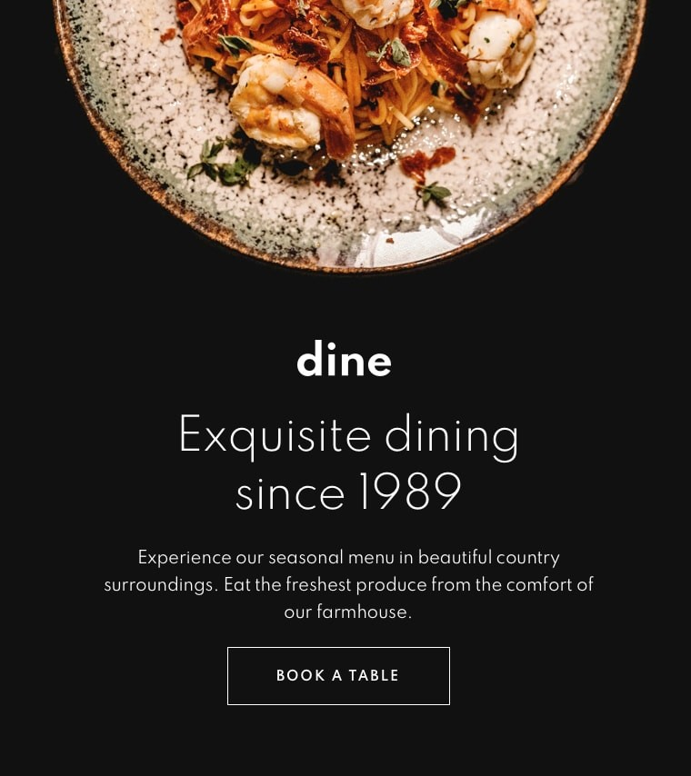

# Dine Restaurant Website API Challenge #

## Welcome! 👋

**To do this challenge, you need a basic understanding of HTML, CSS and JavaScript.**

## The challenge

Your challenge is to build out this landing page, integrate with the [spoonacular API](https://spoonacular.com/food-api) and get it looking as close to the design as possible.

You can use any tools you like to help you complete the challenge. So if you've got something you'd like to practice, feel free to give it a go.

Your users should be able to:

- View the optimal layout for each page depending on their device's screen size
- See hover states for all interactive elements throughout the site
- See the correct content for the Family Gatherings, Special Events, and Social Events section when the user clicks each tab
- Receive an error message when the booking form is submitted if:
  - The Name or Email Address fields are empty should show "This field is required"
  - The Email Address is not formatted correctly should show "Please use a valid email address"
- Any of the Pick a date or Pick a time fields are empty should show "This field is incomplete"

## Where to find everything

Your task is to build out the project to the designs inside the `/design` folder. You will find both a mobile and a desktop version of the design to work to along with active states.

You will find some of the required assets in the `/images` folder. You are free to use your own pictures.

**Have fun building!** 🚀
